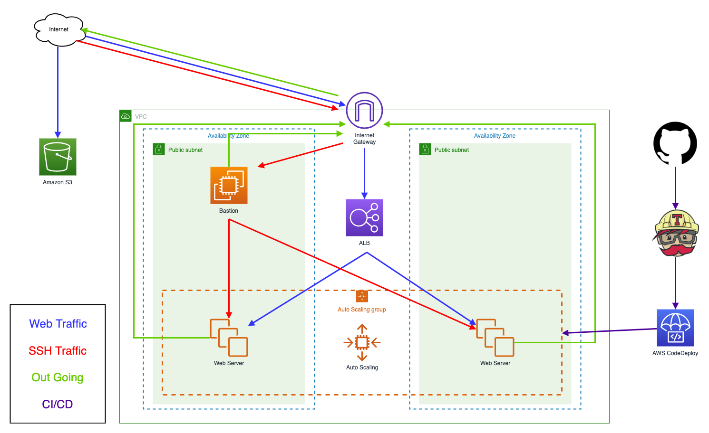

# Lab 1 Packer與AWS CodeDeploy

### 架構圖


### 建立S3 bucket
* Create bucket
	- Bucket Name: **`${user}-web-codedeploy`**

### 建立IAM Role
* ${user}-packer-role
	- type: ec2
	- attach policy **`AWSCodeDeployRole`**
	- inline policy **`packer-build`**
		
		```json
        {
          "Version": "2012-10-17",
          "Statement": [{
              "Effect": "Allow",
              "Action" : [
                "ec2:AttachVolume",
                "ec2:AuthorizeSecurityGroupIngress",
                "ec2:CopyImage",
                "ec2:CreateImage",
                "ec2:CreateKeypair",
                "ec2:CreateSecurityGroup",
                "ec2:CreateSnapshot",
                "ec2:CreateTags",
                "ec2:CreateVolume",
                "ec2:DeleteKeypair",
                "ec2:DeleteSecurityGroup",
                "ec2:DeleteSnapshot",
                "ec2:DeleteVolume",
                "ec2:DeregisterImage",
                "ec2:DescribeImageAttribute",
                "ec2:DescribeImages",
                "ec2:DescribeInstances",
                "ec2:DescribeRegions",
                "ec2:DescribeSecurityGroups",
                "ec2:DescribeSnapshots",
                "ec2:DescribeSubnets",
                "ec2:DescribeTags",
                "ec2:DescribeVolumes",
                "ec2:DetachVolume",
                "ec2:GetPasswordData",
                "ec2:ModifyImageAttribute",
                "ec2:ModifyInstanceAttribute",
                "ec2:ModifySnapshotAttribute",
                "ec2:RegisterImage",
                "ec2:RunInstances",
                "ec2:StopInstances",
                "ec2:TerminateInstances"
              ],
              "Resource" : "*"
          }]
        }
        ```
* ${user}-EC2-WEB
	- type: ec2
	- inline policy **`codedeploy-web-to-s3`**

		```json
		{
		    "Version": "2012-10-17",
		    "Statement": [
		        {
		            "Sid": "Stmt1486165995000",
		            "Effect": "Allow",
		            "Action": [
		                "s3:GetObject",
		                "s3:GetObjectVersion",
		                "s3:ListBucket"
		            ],
		            "Resource": [
		                "arn:aws:s3:::${user}-web-codedeploy/*"
		            ]
		        }
		    ]
		}
		```
		
* Role-CodeDeploy
	- type: codedeploy
	- attach policy **`AWSCodeDeployRole`**

### 建立Packer EC2 Instance
* **`${user}-workshop-packer`**

	- AMI
		- Amazon Linux 2 AMI (HVM)
	- Security Group
		- Port：22, source：MyIP
	- Role
		- **`${user}-packer-role`**

### Build AMI
* Instances
	- **`${user}-workshop-packer`**
* [install packer](scripts/packer_install.sh)
* [generate packer_ami.sh](scripts/packer_ami.sh)
* [generate packer.json](scripts/packer.json)
* packer build AMI
	
	```
	./packer build packer.json
	```
	
### Generate source code
* Instances
	- **`${user}-workshop-packer`**
* generate dir ./tutorial/htdoc

	```
	mkdir -p tutorial/htdoc tutorial/scripts
	```

* [genrate tutorial/appspec.yml](scripts/appspec.yml)
* [genrate tutorial/htdoc/host.php](scripts/host.php)
* [genrate tutorial/scripts/EraseApp.sh](scripts/EraseApp.sh)
* [genrate tutorial/scripts/ServiceStop.sh](scripts/ServiceStop.sh)
* [genrate tutorial/scripts/ServiceStart.sh](scripts/ServiceStart.sh)
* check file

	```
	$ find tutorial/

	tutorial/
	tutorial/appspec.yml
	tutorial/htdoc
	tutorial/htdoc/host.php
	tutorial/scripts
	tutorial/scripts/ServiceStart.sh
	tutorial/scripts/EraseApp.sh
	tutorial/scripts/ServiceStop.sh
	```
* [zip tutorial to s3](scripts/tutorial-to-s3.sh)

### 建立LoadBalancers
* TargetGroups
	- **`${user}-workshop-tg`**
		- Target type: Instance
		- Protocol: HTTP
		- Health Check
			- Ping Protocol：HTTP
			- Ping Port：80
			- Ping Path：/index.html
* Application LB
	- **`${user}-workshop-alb`**
		- Load Balancer Protocol: HTTP
		- Security Group
			- Port：80, source：0.0.0.0/0

### 建立Auto Scaling Group
* Launch Configurations
	- AMI: **先前用packer build出來的AMI**
	- Attach Role **`${user}-EC2-WEB`**
	- Security Group
		- Port：80, source：**`${user}-workshop-alb`**

* Auto Scaling Groups
	- **`${user}-workshop-asg`**
		- add Target Groups: **`${user}-workshop-tg`**
		- health check use ELB
		- Desired：2
		- Min：1
		- Max：2

### 建立CodeDeploy
* CodeDeploy
	- create **`Application name`**: **`${user}-codedeploy-app`**
	- create **`Deployment group name`**: **`In-place`**
	- Service role ARN select **`Role-CodeDeploy`**
	- select **`In-place deployment`**
	- select **`Auto Scaling Group`** add **`${user}-workshop-asg`**
	- Deployment configuration select **`CodeDeployDefault.OneAtATime`**
	- enable **`Load balancer`** select **`Application Load Balancer or Network Load Balancer`**
	- choose a target group **`${user}-workshop-tg`**

* create deployment
	- Application: **`${user}-codedeploy-app`**
	- Deployment group: **`In-place`**
	- Repository type: **`My application is stored in Amazon S3`**
	- Revision location: **`s3://${user}-web-codedeploy/tutorial.zip`**
	- File type: **`.zip`**
	- Content options: **`Overwrite the content`**