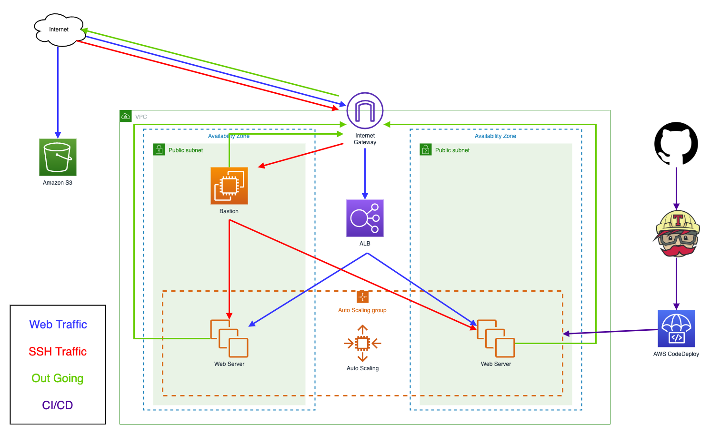

# Lab 3 Github & Travis CI & CodeDeploy
* 延續Lab 1
* 加入 Github 和 Travis CI 完成整個 CI / CD 流程

### 架構圖


### 建立給Travis CI用的User
* IAM
	- User
		- **`${user}-travisci-user`**
			- attach policy **`AWSCodeDeployDeployerAccess`**
			- <details>
				<summary>inline policy **`travisci-codedeploy`**</summary>
				
				```json
				{
				    "Version": "2012-10-17",
				    "Statement": [
				        {
				            "Sid": "Stmt1493702920000",
				            "Effect": "Allow",
				            "Action": [
				                "s3:*"
				            ],
				            "Resource": [
				                "arn:aws:s3:::${user}-web-codedeploy/*"
				            ]
				        }
				    ]
				}
				```
			</details>
			
			
### Github and Travis
* Github
	- Login [https://github.com](https://github.com)
	- create repository -> New
		- repository: aws-lab
* Travis
	- Login [https://travis-ci.org](https://travis-ci.org)
	- Sign in with GitHub
	- go to Accounts
	- Syncing from GitHub
	- enable aws-lab repository
	- assign aws key to travis environment
	- More options -> Settings -> Environment Variables
		- aws_access_key
		- aws_secure_key

### Setting Instances

* Web
	- **`${user}-workshop-asg`**
	- Desired：1
* **`${user}-workshop-packer`**
	- install git
	
	```
	sudo yum install git
	```
	- setting git

	```
	git config --global user.name "circle yu"
	git config --global user.email "circle.yu@nextlink.com.tw"
	```
	- clone repository

	```
	git clone https://github.com/你的帳號/aws-lab
	```
	- copy source code to git repository
	
	```
	cp -R tutorial/* aws-lab/
	```
	- <details>
		<summary>[generate .travis.yml](scripts/.travis.yml)</summary>
		
		```yaml
		language: php
		os:
		- linux
		script: echo "do nothing."
		before_deploy:
		  - zip -r latest *
		  - test -d dpl_cd_upload || mkdir dpl_cd_upload
		  - mv latest.zip dpl_cd_upload/latest.zip
		deploy:
		  - provider: s3
		    access_key_id: $aws_access_key
		    secret_access_key:
		      secure: $aws_secure_key
		    local_dir: dpl_cd_upload
		    skip_cleanup: true
		    region: ap-northeast-1
		    on:
		      branch: master
		    bucket: "${user}-web-codedeploy"
		  - provider: codedeploy
		    access_key_id: $aws_access_key
		    secret_access_key:
		      secure: $aws_secure_key
		    bucket: "${user}-web-codedeploy"
		    key: latest.zip
		    application: ${user}-codedeploy-app
		    deployment_group: In-place
		    region: ap-northeast-1
		    on:
		      branch: master
		```
	</details>

	- modify host.php

	```php
	<?php
	  echo gethostname();
	  phpinfo();
	?>
	```
	- push to repository

	```
	git add .
	git commit -m "first commit"
	git push
	```